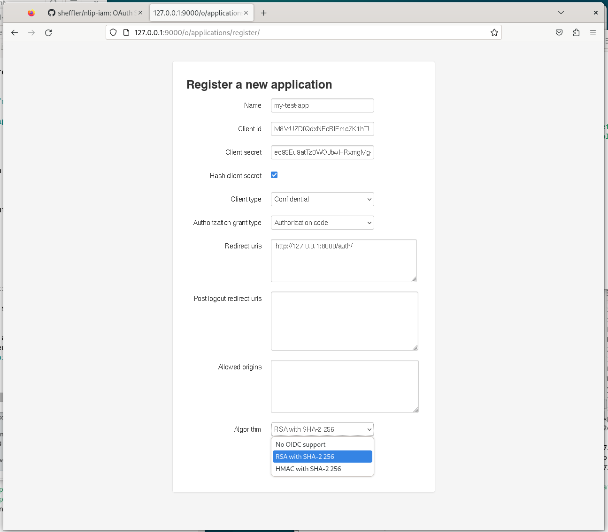
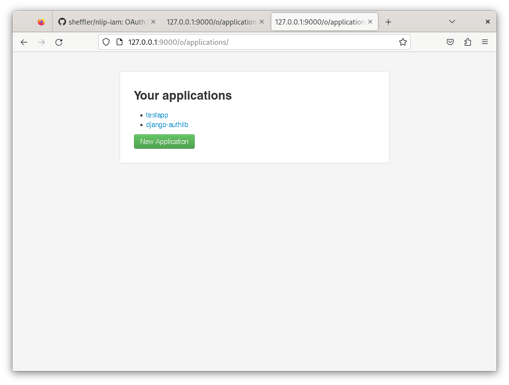
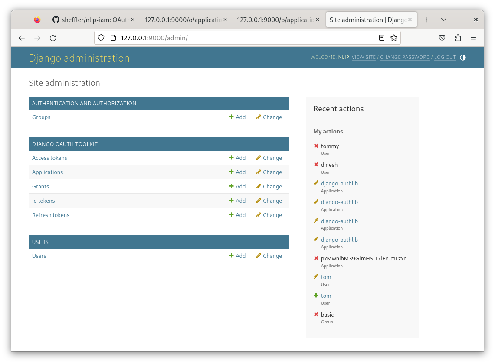

# NLIP Development OAuth Server

This project was created to supply a local OAuth authentication server for use during development. 

Features:

* OAuth server
* OpenID Connect ready
* JWT tokens with OIDC claims
* Admin interface for managing users, among other things.

## Dependencies

Make sure you have python3 installed on your system.

## Set up

1. Create a virtual environment for this project and activate it

        $ python3 -m venv ~/virtualenvs/nlip-iam
	    $ . ~/virtualenvs/nlip-iam/bin/activate

2. Install the requirements

        $ pip install -r requirements.txt

    You should see Django, oauthlib and other modules being installed.
	
3. Migrate the database to create the models.  This will create a sqlite database.

        $ cd nlipiam
		$ python manage.py migrate

4. Create a 'superuser' for this project.  This is the user you will use to log into the admin interface.

        $ python manage.py createsuperuser
		Username: nlip
		Email Address: tom.sheffler@gmail.com
		Password: priority
		Password (again): priority
		
5. Run the server and verify that you can log into the system.

        $ python manage.py runserver 9000
		
	Go to http://127.0.0.1:9000/admin and see if you can log in as 'nlip'
	with the password you gave.
	
6. Create some normal users.  For reproducibility you can use the
    script provided.
   
        $ python manage.py shell < ../create_std_users.py

That's it.  You now have an OAuth authentication provider with two users, an Admin interface.

## Register a new Application

You need to register an Application before you can use it with this server.  To begin, go to the following URL.

    http://127.0.0.1:9000/o/applications/register
	
Give your application a name, like `nlipapp`.  Take note of the

* Client ID
* Client SECRET

These are the credentials you will put in your app.

For "Client type" select "Confidential".

For "Authorization grant type" select "Authorization Code".

Select "Hash client secret".

For the "redirect_uri" use the following:

    http://127.0.0.1:8000/auth/
	
This will be the URI of the test application we will describe later.

To enable JWT and OPEN ID CONNECT (OIDC) select "RSA with SHA-2 256" in the drop-down box.

>. Note: these last two require registering a private key with the authentication server.  We have already provided one in the file `nlip/oidc.key` and have included it in the settings in `nlip/oidc.key`.  If you would like to replace this key you can generate one this way.

    $ cd nlipiam
	$ openssl genrsa -out oidc.key 4096

## See registered applications

	http://127.0.0.1:9000/o/applications/
	

## Use the Admin interface

You can use the Admin interface at http://127.00.0.1:9000/admin/ to create and delete users and look at other data in the system.

## Test this server

Use the assocated project, "nlip-iam-test" to see if you can log in and authorize scopes.

## Caveats

* localhost and 127.0.0.1 are different in the context of the "redirect_uri".  When the Oauth server receives an authentication request from an Application, it will use the Client ID to look up the "redirect_uri", and if it does not match exactly the client will be rejected.

* Care should be taken before running this project in production on a public IP for managing secrets appropriately.

## Maintenance

Use the "cleartokens" command periodically to clean up expired tokens.

    $ python manage.py cleartokens

## References

https://django-oauth-toolkit.readthedocs.io/en/latest/getting_started.html

https://django-oauth-toolkit.readthedocs.io/en/latest/tutorial/tutorial_01.html#scenario

https://django-oauth-toolkit.readthedocs.io/en/latest/oidc.html

